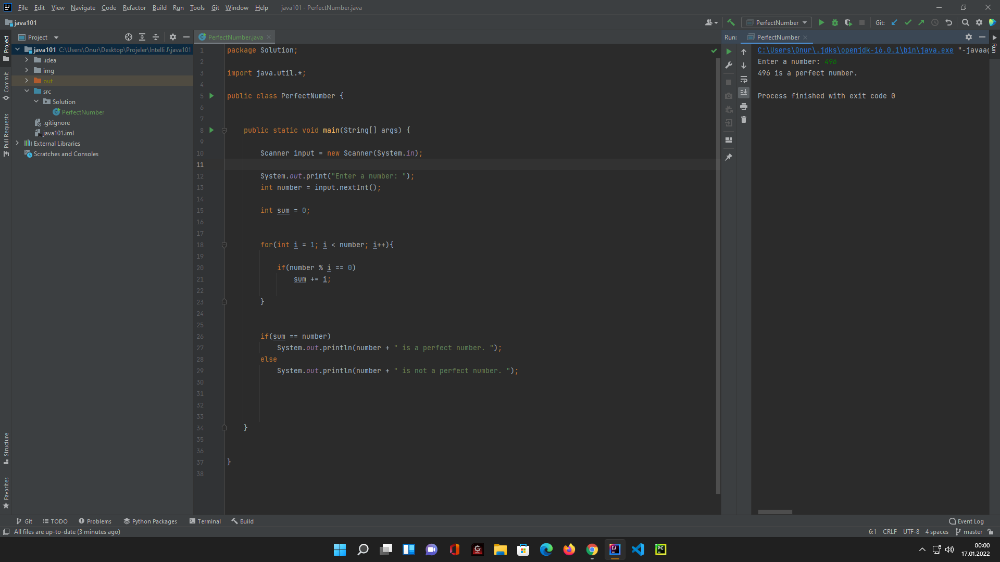
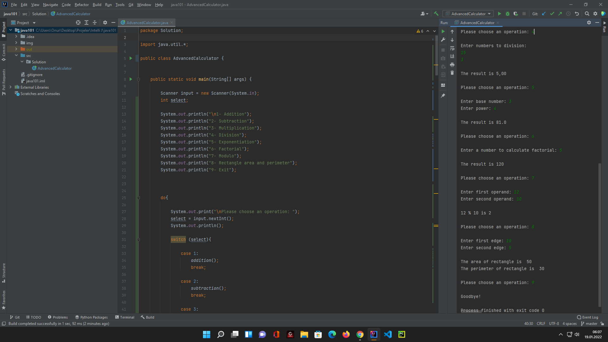

# AdvancedCalculator

A functional calculator made in java language.

It has a menu contains operations to do.

Accepts int and double values.

1- Addition
2- Subtraction
3- Multiplication
4- Division
5- Exponentiation
6- Factorial
7- Modulo
8- Rectangle area and perimeter
9- Exit

