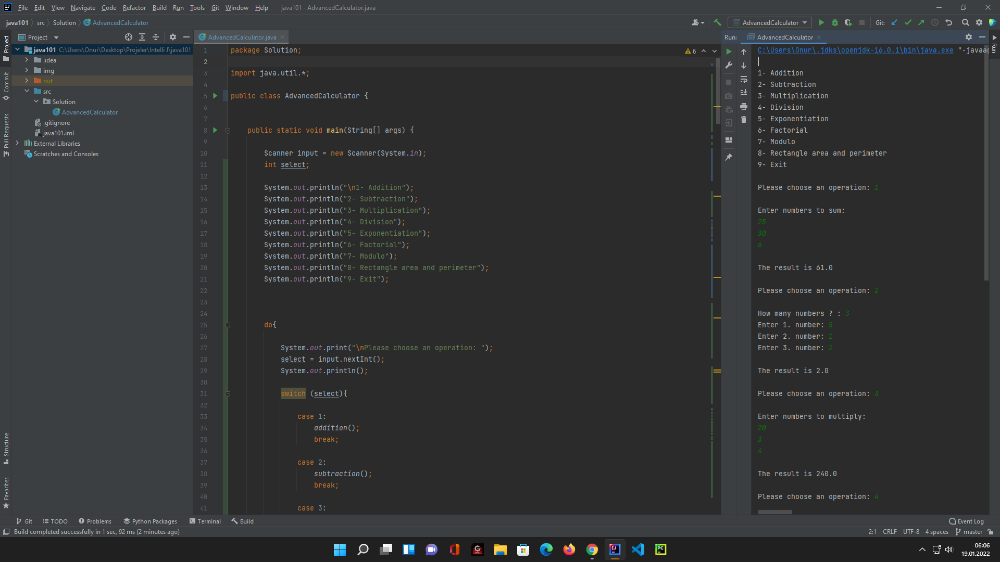

# AdvancedCalculator

A functional calculator made in java language.

It has a menu contains operations to do.

Accepts int and double values.

1- Addition  
2- Subtraction  
3- Multiplication  
4- Division  
5- Exponentiation  
6- Factorial  
7- Modulo  
8- Rectangle area and perimeter  
9- Exit

